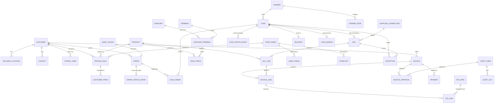

# RPG Fuel Platform — Data Model

**Source:** [RPG Fuel Platform Build-Out Plan](./docs/source/RPG_Fuel_Platform_Buildout_Plan_3.md)
(Royalty Petroleums Group LLC), modules A–J and the phased roadmap.
**Purpose:** the entity model the platform needs to support every module in
the plan, organized by the lifecycle the plan itself uses:

```
Customer Order → Order Intake → Pricing → Carrier/Load Tracking → Supplier BOL
             → Customer Delivery → Billing → Profitability
```

**Conventions:** UUID primary keys; `created_at`, `updated_at`, `created_by`
on every table; money as integer cents or `numeric(14,4)`; gallons as
`numeric(12,3)`; prices per gallon as `numeric(10,5)` (fuel prices are quoted
to four or five decimals); all timestamps in UTC with the terminal's local
time zone stored where it matters (BOL times). Postgres is assumed, per the
SaaS audit. Rows that record what happened (status events, price snapshots,
BOLs, audit log) are append-only.

---

## 1. Entity map



## 2. Reference data (Phase 1 foundation)

### `customer`
| Column | Type | Notes |
| --- | --- | --- |
| id | uuid | |
| name | text | legal name |
| code | text | short code used on orders and invoices |
| billing_address | jsonb | |
| payment_terms_days | int | net 10, 15, 30 |
| credit_limit_cents | bigint | nullable; see credit hold in exceptions |
| billing_basis | enum(net, gross) | which gallons the customer is billed on |
| tax_exempt_certificate | jsonb | number, state, expiry; nullable |
| quickbooks_customer_id | text | nullable until Phase 5 |
| status | enum(active, on_hold, inactive) | |

### `delivery_location`
| Column | Type | Notes |
| --- | --- | --- |
| id, customer_id | uuid | |
| name | text | "Yard 3", "Store #12" |
| address | jsonb | street, city, state, zip, geo |
| tax_jurisdiction_code | text | drives destination taxes |
| delivery_instructions | text | gate codes, hours |
| tank_profile | jsonb | optional: product, capacity, fill limit |

### `contact`
customer_id, name, title, email, phone, role (ordering, billing, receiving),
notification preferences.

### `product`
| Column | Type | Notes |
| --- | --- | --- |
| id | uuid | |
| code | text | ULSD2, CLR-DSL, DYED-DSL, UNL87, UNL89, PRM93, E10, DEF |
| name | text | |
| category | enum(diesel, gasoline, ethanol_blend, def, other) | |
| dyed | bool | dyed diesel is off-road and taxed differently |
| default_uom | text | gallon |
| tax_category_code | text | joins `tax_rate` |

### `supplier`, `terminal`, `supplier_terminal`
- `supplier`: name, code, account numbers, contact, `bol_source` (enum manual, email, api, sftp).
- `terminal`: name, code (IRS TCN where known), city, state, time zone, rack hours.
- `supplier_terminal`: supplier_id, terminal_id, products offered (array of product_id), allocation notes, active.

### `carrier`
name, code, MC/DOT numbers, insurance expiry, contacts, default rate basis.
Optional `driver` (carrier_id, name, phone) and `truck` (carrier_id, unit,
compartments jsonb) when dispatch detail is needed.

### `staff_user`
id (auth provider id), email, name, role (admin, management, dispatch,
pricing, billing, viewer), active. See [AUTH_PLAN.md](./AUTH_PLAN.md).

### `portal_user`
id (auth provider id), customer_id, email, name, role (viewer, orderer),
active. A portal user sees only rows where `customer_id` matches (Module G).

## 3. Pricing (Modules A, C, D)

### `price_index`
| Column | Type | Notes |
| --- | --- | --- |
| id | uuid | |
| code | text | e.g. OPIS-RACK-DALLAS-ULSD, NYMEX-HO, PLATTS-GC-87 |
| name, source | text | provider; feeds are licensed |
| product_id | uuid | nullable for crude/benchmark indexes |
| unit | text | $/gal |
| refresh_cadence | text | daily, intraday |

### `index_price` (append-only)
price_index_id, observed_at, effective_date, value, change_from_prior,
source_ref (feed id or import file). Powers the market tracker charts.

### `rack_price` (append-only)
| Column | Type | Notes |
| --- | --- | --- |
| id | uuid | |
| supplier_terminal_id, product_id | uuid | |
| effective_at | timestamptz | rack postings change at specific times; store the time, not just the day |
| price_per_gallon | numeric(10,5) | supplier base price |
| source | enum(manual, import, feed) | |
| entered_by | uuid | staff_user; null for feeds |

### `pricing_rule`
| Column | Type | Notes |
| --- | --- | --- |
| id | uuid | |
| customer_id | uuid | nullable = default rule for all customers |
| product_id | uuid | |
| terminal_id | uuid | nullable = any terminal |
| delivery_location_id | uuid | nullable = any location |
| basis_type | enum(rack, index, fixed) | contract vs. spot in the plan: fixed = contract |
| basis_ref | uuid | supplier_terminal_id or price_index_id |
| differential_per_gallon | numeric(10,5) | markup/margin |
| freight_per_gallon | numeric(10,5) | or freight_per_load_cents |
| fees | jsonb | named fees per gallon or per load |
| tax_treatment | enum(taxable, exempt, dyed) | overrides product default |
| effective_start, effective_end | timestamptz | |
| priority | int | tie-break when several rules match |
| status | enum(draft, active, expired) | |

Evaluation order (documented so the engine is testable): most specific
match wins (location > terminal > customer default > global), then latest
`effective_start`, then highest `priority`. Every evaluation writes a
`customer_price` row so a quoted price can always be explained.

### `customer_price` (append-only snapshot)
customer_id, product_id, terminal_id, delivery_location_id, price_date,
computed_at, pricing_rule_id, basis_value, differential, freight, fees,
taxes_estimate, sell_price_per_gallon, explanation (jsonb of the inputs).
This is the "auto-calculated daily customer price dashboard" and the audit
trail for disputes.

### `forecast` (Module D)
price_index_id or product_id, target_date, direction (up, down, flat),
confidence (0–1), model_version, features_snapshot (jsonb), created_at,
realized_direction (filled in the next day for backtesting).

## 4. Orders and intake (Modules G, H)

### `email_intake`
| Column | Type | Notes |
| --- | --- | --- |
| id | uuid | |
| mailbox | text | which inbox |
| message_id, received_at, from_address, subject | text | |
| raw_storage_key | text | object storage key for the .eml and attachments |
| parsed | jsonb | customer, location, product, gallons, requested window, PO, instructions |
| parse_confidence | numeric | per field inside `parsed` too |
| review_status | enum(pending, approved, rejected, duplicate) | |
| reviewed_by, reviewed_at | | |
| order_id | uuid | set when approved |

### `order`
| Column | Type | Notes |
| --- | --- | --- |
| id | uuid | |
| order_number | text | human-facing, sequential per year |
| customer_id, delivery_location_id, product_id | uuid | |
| requested_gallons | numeric(12,3) | |
| requested_window_start, requested_window_end | timestamptz | |
| customer_po | text | |
| special_instructions | text | |
| source | enum(email, manual, portal) | |
| email_intake_id | uuid | nullable |
| status | enum(received, confirmed, carrier_confirmed, in_transit, delivered, cancelled) | Module G milestones |
| credit_hold | bool | set when the customer is over limit or past due |

### `order_status_event` (append-only, immutable)
order_id, from_status, to_status, occurred_at, actor_id (staff or system),
note. Required by the plan's audit-trail consideration.

## 5. Loads, BOLs, deliveries (Modules E, F)

### `load`
| Column | Type | Notes |
| --- | --- | --- |
| id | uuid | |
| load_number | text | |
| carrier_id, driver_id, truck_id | uuid | driver/truck nullable |
| supplier_terminal_id | uuid | planned lift point |
| scheduled_pickup_at, scheduled_delivery_at | timestamptz | |
| status | enum(planned, dispatched, loading, in_transit, delivered, closed) | operational |
| billing_status | enum(bol_received, pricing_verified, ready_to_invoice, invoiced, paid) | Module F workflow; nullable until a BOL exists |
| freight_cost_cents | bigint | from `carrier_rate` or carrier invoice |

### `load_order`
load_id, order_id, allocated_gallons. Many-to-many: one truck can serve
two orders (split load) and one order can need two trucks.

### `load_status_event` (append-only, immutable)
Same shape as `order_status_event`; customer-visible milestones are derived
from these.

### `bol`
| Column | Type | Notes |
| --- | --- | --- |
| id | uuid | |
| bol_number | text | unique per supplier_terminal |
| supplier_id, terminal_id, carrier_id | uuid | |
| load_id | uuid | nullable until matched; unmatched BOLs are an exception |
| lifted_at | timestamptz | BOL date/time, with terminal time zone |
| destination_text, customer_ref | text | as printed; used for customer matching |
| source | enum(feed, email, manual) | |
| supplier_connection_id | uuid | nullable |
| document_storage_key | text | PDF/image of the BOL |
| dedupe_hash | text | supplier + bol_number + lifted_at; unique index |
| match_status | enum(unmatched, matched, disputed) | |

### `bol_line`
bol_id, product_id, gross_gallons, net_gallons (temperature-corrected),
temperature_f, api_gravity, supplier_cost_per_gallon, supplier_cost_total,
taxes (jsonb by component), fees (jsonb). A BOL commonly carries several
products in different compartments, so lines are first-class.

### `delivery`
load_id, delivered_at, delivered_gallons, receiver_name, pod_storage_key
(signed ticket), meter_start/meter_end (optional), notes.

## 6. Billing and money (Module I, Phase 5)

### `tax_rate`
jurisdiction_code, product tax_category_code, component (federal_excise,
state_excise, environmental, lust, sales, county/local), rate_per_gallon or
rate_percent, effective_start, effective_end. Rates change on fixed dates,
so effective dating is mandatory.

### `invoice`
| Column | Type | Notes |
| --- | --- | --- |
| id | uuid | |
| invoice_number | text | |
| customer_id | uuid | |
| status | enum(draft, pending_approval, approved, synced, sent, paid, void) | approval is a hard gate before `synced` |
| subtotal_cents, tax_cents, freight_cents, fees_cents, total_cents | bigint | |
| quickbooks_invoice_id, quickbooks_synced_at | | |
| due_date | date | from customer terms |

### `invoice_line`
invoice_id, bol_line_id (or delivery_id), product_id, billed_gallons
(net or gross per customer `billing_basis`), price_per_gallon,
customer_price_id (the snapshot that justified the price), freight_cents,
fees jsonb, line_total_cents.

### `tax_line`
invoice_line_id, tax_rate_id, component, gallons, rate, amount_cents.

### `invoice_approval`
invoice_id, approver_id (staff_user with management role), decision
(approved, rejected), reason, decided_at. The plan requires management
approval before QuickBooks; this table is the evidence.

### `payment`
invoice_id, quickbooks_payment_id, amount_cents, received_at, method.
Synced from QuickBooks; drives `paid` status and AR aging.

### `carrier_rate`
carrier_id, origin_terminal_id, destination_zone or delivery_location_id,
rate_basis (per_gallon, per_load, per_mile), rate, minimum_cents,
effective dates. Needed for expected freight cost before the carrier
invoice arrives.

## 7. Profitability and controls (Modules B, F, J)

### `load_margin` (computed, refreshed on every change to its inputs)
load_id, revenue_cents (invoice lines), supplier_cost_cents (BOL lines),
taxes_passthrough_cents, freight_cost_cents, other_costs_cents,
expected_gross_profit_cents (from `customer_price` at order time),
actual_gross_profit_cents, profit_per_gallon, variance_cents, computed_at.
Roll-ups by customer, day, week, month are queries over this table.

### `exception`
| Column | Type | Notes |
| --- | --- | --- |
| id | uuid | |
| type | enum(missing_bol, unassigned_customer, pricing_missing, pricing_mismatch, duplicate_bol, uninvoiced_load, low_margin, loss_load, cost_variance, credit_hold, stale_index) | Module F list plus margin and credit |
| severity | enum(info, warning, critical) | |
| entity_type, entity_id | | load, bol, order, invoice, customer |
| detected_at, detected_by_rule | | validation rules are config, per the plan |
| status | enum(open, acknowledged, resolved, ignored) | |
| resolved_by, resolved_at, resolution_note | | |

### `audit_log` (append-only)
actor_id (staff, portal user, or system), action, entity_type, entity_id,
before (jsonb), after (jsonb), occurred_at, request_id.

### `alert_subscription` / `notification`
Who gets daily market movement alerts, exception digests, and customer
status emails; delivery channel; sent log.

## 8. Integrations (config, not hardcoded)

- `supplier_connection`: supplier_id, kind (sftp, api, email_parser),
  credentials_ref (secret manager key), schedule, last_run_at, last_status.
- `index_source`: provider, credentials_ref, indexes covered, schedule.
- `mailbox_connection`: provider (Microsoft 365 or Google), credentials_ref,
  folder, last_polled_at.
- `quickbooks_connection`: edition (online or desktop), realm_id,
  oauth_tokens_ref, sync cursor, last_sync_at, error log.
- `integration_run`: connection type/id, started_at, finished_at, status,
  records_in, records_out, error (the operational log for every feed).

## 9. Mapping from the current codebase

| Current entity (`agent/src/crm/types.ts`) | Becomes | Notes |
| --- | --- | --- |
| `Account` | `customer` (+ `delivery_location`) | keep enrichment as a customer note; add terms, credit, billing basis |
| `Contact` | `contact` | add role and notification preferences |
| `Deal` with `lineItems` | `order` + `load` + `load_order` | a deal is closest to an order; loads are new |
| `Product` (hardware catalog) | `product` (fuel) | catalog fields (photo, specs, blurb) dropped; tax category added |
| `Salesperson` | `staff_user` | roles change from AE/SDR/Manager to dispatch/pricing/billing/management |
| `Activity` | `order_status_event`, `load_status_event`, `audit_log` | split by purpose; all immutable |
| `Quote` (hardware quote) | `customer_price` snapshot | a fuel "quote" is a price per gallon, not a bill of materials |
| `Report` | management dashboard queries + saved `report` | keep the reports page; feed it from `load_margin` |
| Stage enum (Lead → Closed) | order status and load billing status enums | two workflows instead of one |

## 10. Open modeling questions

1. Is RPG the only operator (single tenant with customer portals), or will
   the platform be sold to other distributors? The second case adds
   `organization_id` to every table above, per the SaaS audit.
2. Billing basis: net or gross gallons by default, and does it vary by
   customer or by product? This changes `invoice_line` and margin math.
3. Tax scope: which states, and does RPG collect and remit or is every sale
   tax-included from the supplier? Determines how deep `tax_rate` must go.
4. Freight: does RPG own trucks, use carriers, or both? Owned fleet adds
   driver hours, fuel, and maintenance to the cost side of margin.
5. Split loads and multi-product BOLs: how common? They justify
   `load_order` and `bol_line` as separate tables rather than columns.
